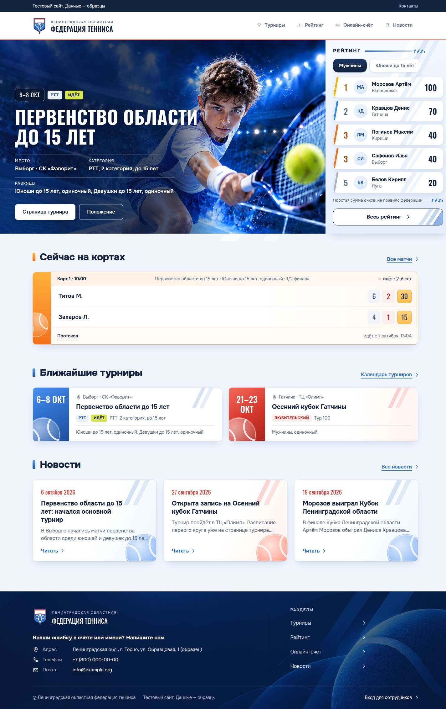
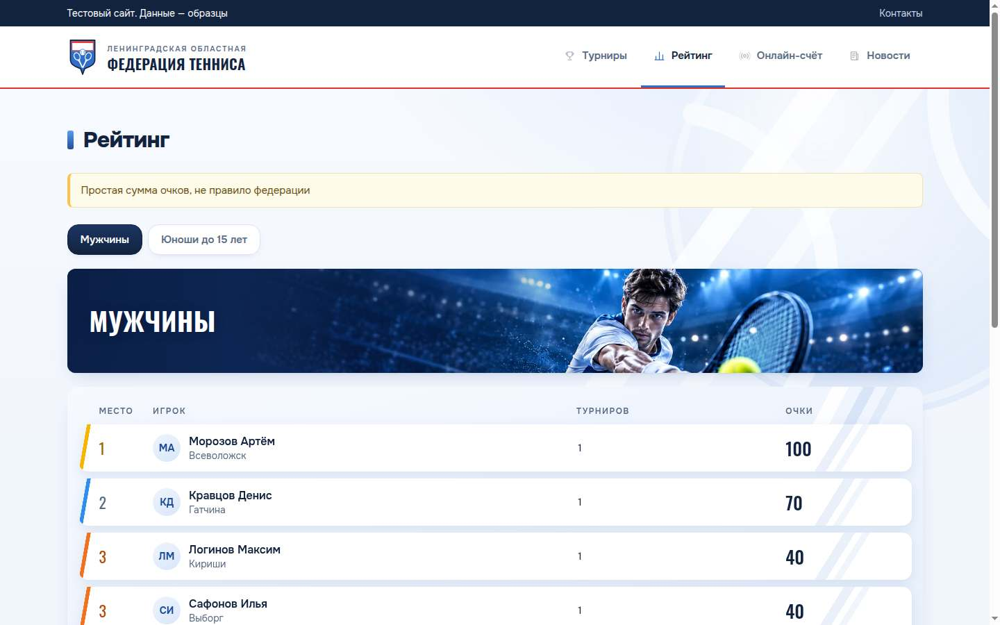
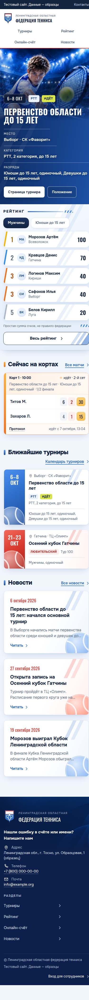
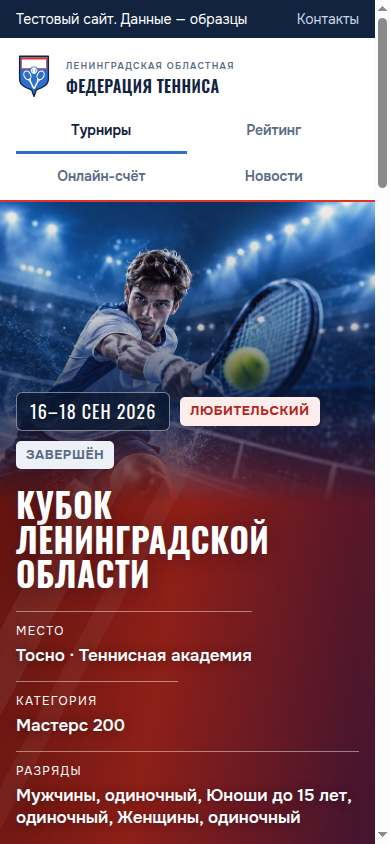

# Выпуск: новый облик сайта

Новый облик слит в `staging` и работает на тестовом сайте: https://pane-server.tail9feca9.ts.net:23006/

## Итог

- Ветка `update-the-visual-design-of-the-existing-interface-while-work` слита в `staging` коммитом слияния `0a9f5c63656c33fc975ae5b54b03152d9ccd6d56`.
- Все тесты проекта на слиянии прошли: 13 файлов, 262 теста. Сборка прошла.
- `staging` отправлен на GitHub. `main` не менялся.
- Тестовый сайт перешёл на новый коммит через минуту после отправки.
- Новых изменений базы нет: последняя миграция прежняя, `001_init`, ожидающих нет.
- Решений перед закрытием не требуется.

## Ответ проверки сайта

Адрес: https://pane-server.tail9feca9.ts.net:23006/api/health

```json
{"ok":true,"commit":"0a9f5c63656c33fc975ae5b54b03152d9ccd6d56","migration":{"latest":"001_init","pending":0},"seed":{"latest":"001_samples","pending":0}}
```

## Что видно на тестовом сайте

Открыты страницы посетителя, без входа: главная, турниры, идущий и завершённый турнир, рейтинг, игрок. На компьютере, 1440 пикселей, и на телефоне, 390 пикселей.

- Фото лиг от заказчика: юноша в шапке главной и идущего турнира, мужчина в полосе рейтинга, круглые фото у разрядов в итогах. Все загружаются, ни одного битого.
- Тёмно-синяя подложка под текстом на фото: в шапках, в полосе группы рейтинга, в подвале.
- Рейтинг косыми строками: белые строки, косая полоса цвета места — золото, синий, оранжевый.
- Ни одна страница не прокручивается вбок на телефоне.
- Ошибок самого сайта в консоли нет. Одна строка с ошибкой 401 — от виджета сообщений об ошибках, он спрашивает вход на доске. Виджет добавлен до этой задачи.









## После выпуска

Этот документ отправлен в `staging` отдельным коммитом поверх слияния. В нём только документ и снимки.
