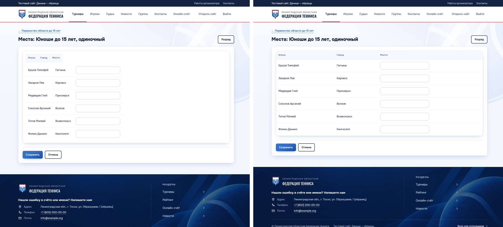
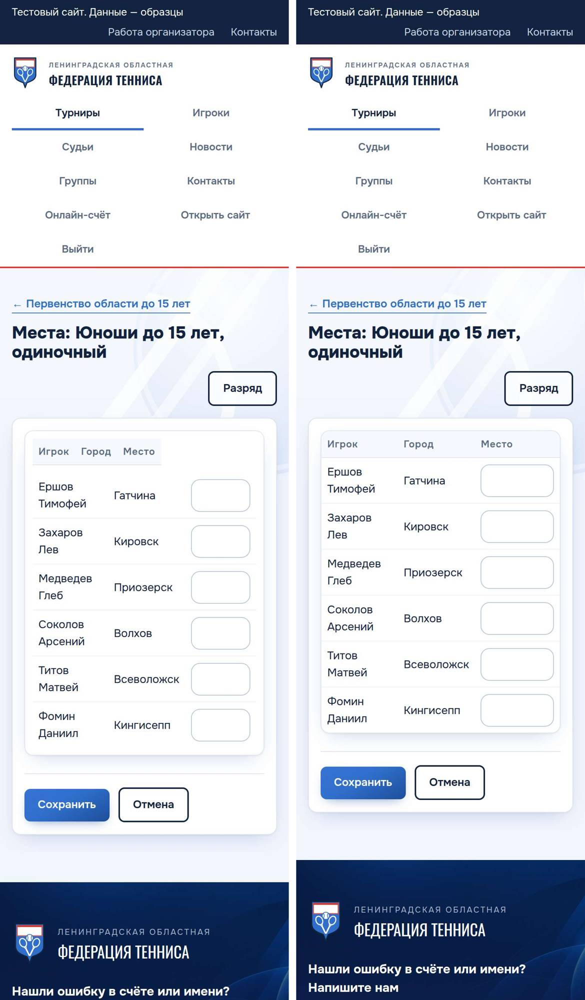

# Проверка работы: новый облик сайта

Проверен новый облик на сайте задачи и её базе. Проверены все семь историй: страницы посетителя, ввод данных организатором, ведение счёта судьёй. На компьютере и на телефоне.

## Итог

- Оценка здоровья сайта: 97,7 до правки, 98,5 после, из 100.
- Найден 1 дефект, исправлен:
  - у организатора на экране «Места» подписи столбцов «Игрок», «Город», «Место» не стояли над своими столбцами.
- Ошибок в консоли нет. Битых ссылок нет. Ни одна страница не прокручивается вбок на телефоне от 320 пикселей.
- Ввод данных организатором и счёт судьи работают как раньше.
- Решений перед приёмкой не требуется.

## Как проверяли

- Сайт задачи, его база с образцами данных. Входы — под образцами учётных записей организатора и судьи из этой базы.
- Компьютер: ширина 1440 пикселей. Телефон: 390 пикселей, касания, как на iPhone 14. Отдельно 320 пикселей.
- Всё, что меняли в данных, после проверки вернули: корт финала и места девушек.

## Найдено и исправлено

1. **Экран «Места» у организатора: подписи не над столбцами.**
   - Где: «Турниры» → турнир → разряд → «Места». На компьютере и телефоне.
   - Что было: подписи «Игрок», «Город», «Место» стояли тесно слева. Столбцы под ними шли шире, поле места было далеко справа от подписи. Ввод работал.
   - Причина: новое правило для списка мест в итогах турнира срабатывало и на таблице организатора: у них одно имя.
   - Что сделано: правило теперь только для списка мест на сайте. Список мест на сайте не изменился, снимки до и после совпадают до точки.
   - Коммит `56c073a`.
   - Важность: средняя.

   

   

## Проверено без замечаний

- **S1, лиги.** Мужчины — фото мужчины, женщины — женщины, юноши — юноши, девушки — девушки: в шапке турнира, в полосе разряда, в рейтинге, в итогах. Все фото — от заказчика. Все загружаются.
- **S2, текст на фото.** Измерен контраст каждой строки текста на фото при 1440, 390 и 320 пикселях:
  - шапки главной и турниров: не ниже 8,2:1;
  - подвал: не ниже 7,97:1;
  - название группы рейтинга: 4,68:1 при 320 пикселях, порог для крупного текста 3:1.
- **S3, рейтинг.** Главная, рейтинг, итоги таблицей и списком, карточка игрока: те же белые строки и косая полоса. Организатор вписал места 1, 2, 3 — на сайте появились золотая, синяя и оранжевая полосы. Места стёрты — список пропал.
- **S4, телефон.** 14 страниц при 320 и 390 пикселях: нет прокрутки вбок, нет битых картинок, нет ошибок. Экраны организатора и судьи на телефоне тоже.
- **S5, привычный путь.** Меню, порядок блоков, тексты как раньше. Обход всех ссылок сайта: 60 адресов, мёртвых нет, ошибок нет.
- **S6, организатор.** Вход, список турниров, форма матча, смена корта с показом на сайте, места разряда, проверка пустой формы новости: «Укажите заголовок», «Напишите текст новости».
- **S7, судья.** Вход, список матчей, очко, тот же счёт в «Онлайн-счёте», отмена очка — счёт вернулся.
- Тесты, которых касается ветка: 3 файла, 70 тестов, все прошли. Сборка прошла.

## Отложено

С проверки внешнего вида, без изменений:

- на широком экране в списке турниров по одной карточке в группе, справа пусто;
- главная от 1081 до 1279 пикселей: лицо юноши обрезано у правого края шапки;
- подписи столбцов таблиц на телефоне 11 пикселей;
- дата новости красная, контраст 4,47:1, цвет был таким до задачи.

## Оценка здоровья

- Консоль: 100.
- Ссылки: 100.
- Внешний вид: 86 до правки, 94 после.
- Работа функций: 100.
- Удобство: 100.
- Скорость: 100.
- Тексты: 100.
- Доступность: 94.
- Итог: 97,7 до правки, 98,5 после.
