# Визуальная проверка: новый облик сайта

Проверен новый облик на ветке задачи, на её сайте и её базе. Сравнение — с образцами заказчика, фотографиями от заказчика и последним одобренным показом. Новый облик не придумывался: правились только дефекты.

## Итог

- Облик совпадает с образцами заказчика и одобренным показом:
  - светло-голубая страница, тёмно-синий текст, белые карточки с синими штрихами и мячом;
  - фотографии игроков от заказчика, у каждой лиги своя;
  - тёмно-синяя полупрозрачная подложка под текстом на фотографиях;
  - рейтинг на всех страницах в одном виде: белые строки, косая цветная полоса места, штрихи справа;
  - тёмно-синий подвал с картинкой заказчика.
- Найдено 4 дефекта, все исправлены. Все четыре — о тексте на фотографии или на телефоне:
  1. планшет: строка разрядов заходила на белую рубашку игрока, контраст 2,64:1;
  2. телефон 320 пикселей: в итогах турнира фамилии рвались посреди слова;
  3. главная от 1081 до 1440 пикселей: заголовок снова закрывал лицо юноши;
  4. планшет от 761 до 860 пикселей: заголовок доходил до лица игрока.
- После правок текст шапок и подвала на фотографиях даёт контраст не ниже 7,9:1 на всех проверенных ширинах. Название группы рейтинга на телефоне 320 пикселей — 4,68:1. Порог — 4,5:1 для обычного текста и 3:1 для крупного.
- На ширине 1440 пикселей и шире вид не изменился. Правки действуют только на более узких экранах.
- Мелочи, отложенные с причинами, — в «Отложено».
- Оценка дизайна: до правок B+, после A−. Оценка шаблонности: B до и после, вид задан образцами заказчика.
- Решений руководителя не требуется.

## Как проверяли

- Сайт задачи через общий запуск рабочих копий. Отдельный браузер этой рабочей копии без окна.
- Ширина экрана: 1920, 1440, 1380, 1300, 1100, 1081, 1000, 900, 860, 800, 761, 375 и 320 пикселей.
- Страницы: главная, турниры, идущий, завершённый и не начатый турнир, рейтинг обеих групп, игрок, онлайн-счёт, новости, протокол матча, вход, экран судьи, экраны организатора.
- Экраны судьи и организатора — под образцами учётных записей из базы задачи. Данные не менялись.
- Читаемость текста на фотографиях измерена, а не на глаз:
  - текст прячется, снимается фон под каждой строкой;
  - берётся самый светлый участок фона под строкой, без 5 % самых светлых точек;
  - считается контраст с цветом текста.
- Отдельно измерено, где кончается текст шапки и где начинается лицо игрока, через каждые 40 пикселей ширины от 780 до 1920.

## Сверка с образцами заказчика

- **Шапка главной.** Как в образце: дата, метки, крупный заголовок, сведения, две кнопки; фотография справа; рейтинг справа на светлой панели. В образце взрослый игрок, на сайте юноша: турнир «до 15 лет» берёт фотографию юноши, так решено в Брифе.

  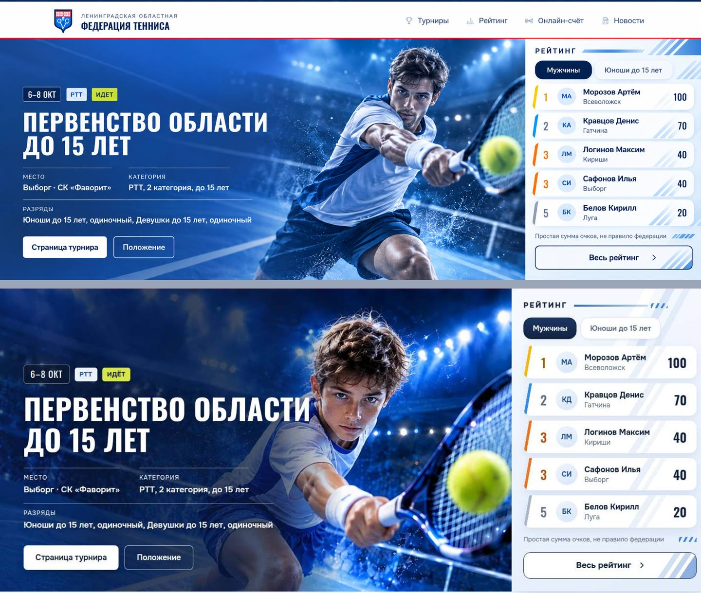

- **Рейтинг.** Совпадают светлая панель, белые строки, косая полоса цвета места, кружки с инициалами, штрихи справа, кнопка «Весь рейтинг» с синей рамкой.

  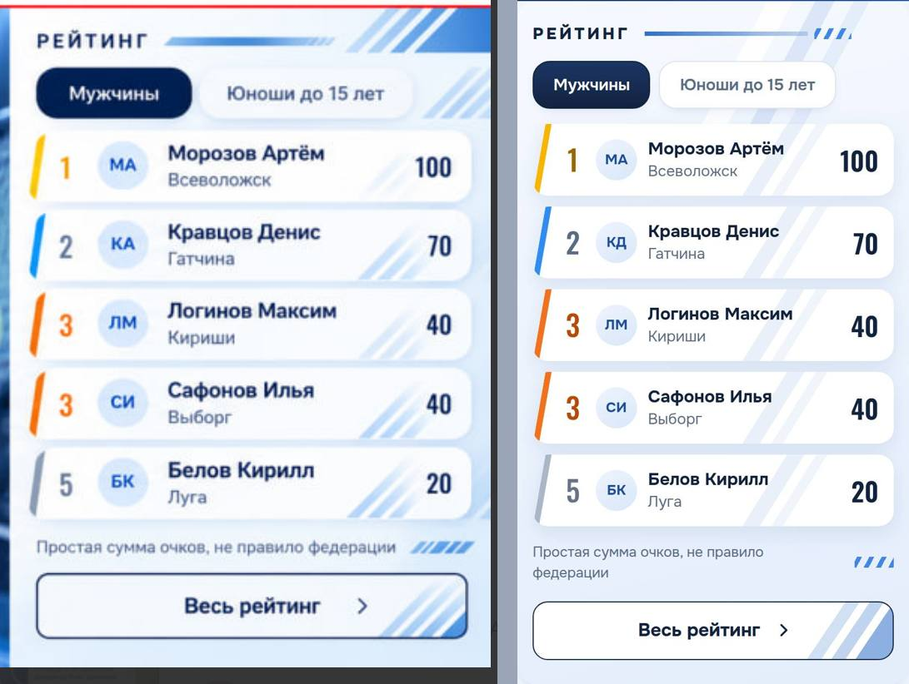

- **Тот же рейтинг на других страницах.** Страница рейтинга, итоги турнира в таблице и списком, карточка очков игрока — та же строка и та же косая полоса.

  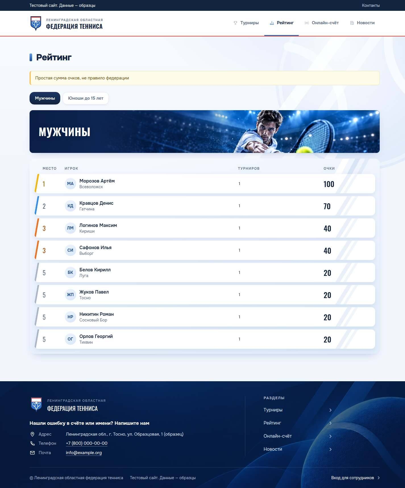

  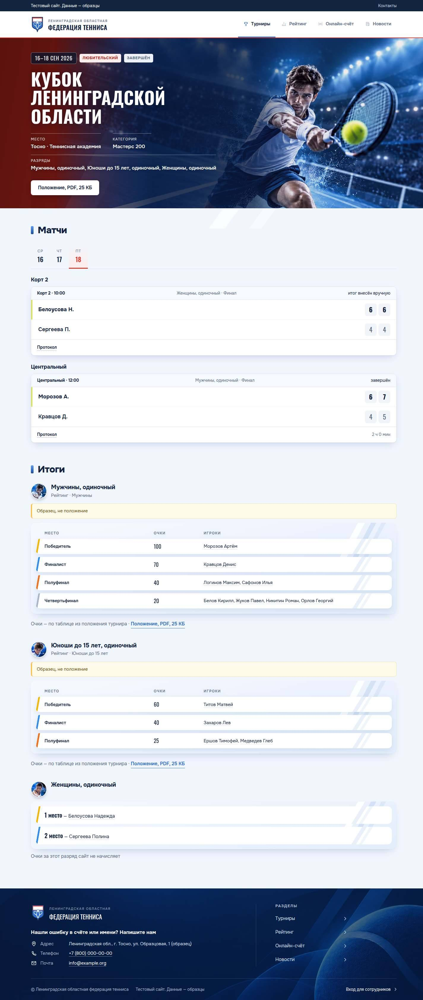

- **Подложка под текстом.** На главной, в шапке турнира, в полосе группы рейтинга и в подвале. Плотная у текста, к лицу игрока сходит на нет, фотография видна.

  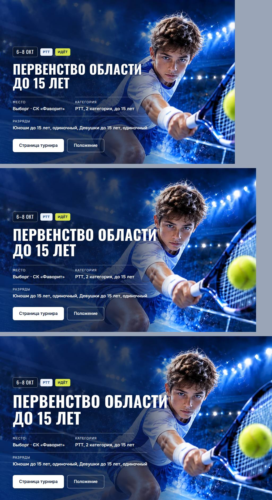

- **Фотографии по лигам.** Мужчины — мужчина, юноши — юноша, женщины — женщина. Это видно в итогах турнира, в полосе группы рейтинга, в карточке игрока. Все фотографии загружаются.
- **Палитра.** Синий и белый, тёмно-синий текст. Оранжевый — только у «Сейчас на кортах» и третьего места, красный — у любительского турнира и дат новостей.
- **Телефон.** Фотография над текстом шапки, рейтинг под шапкой, подвал в одну колонку. Мяч в подвале не лежит на тексте.

  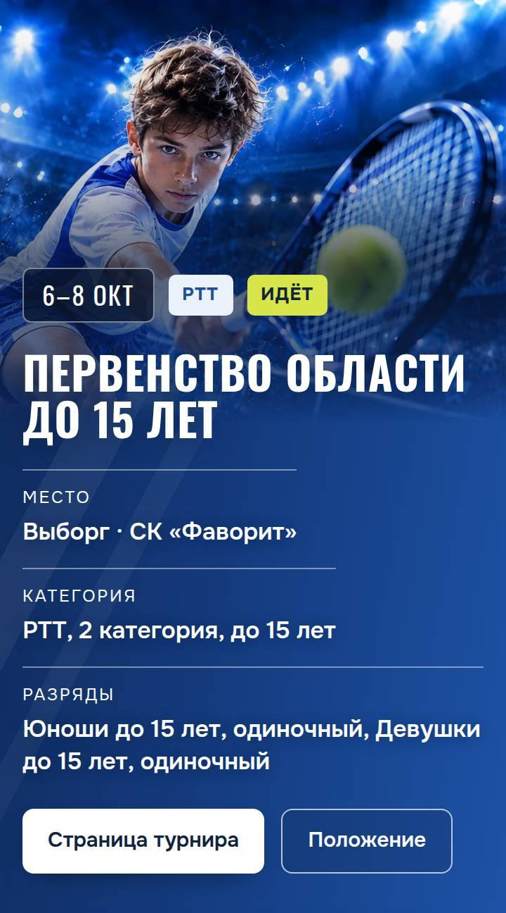

  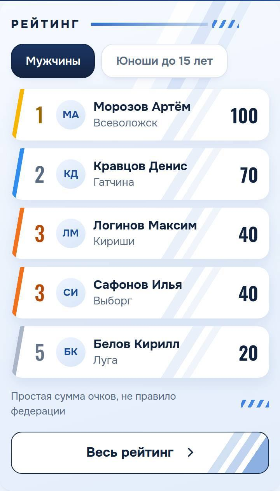

  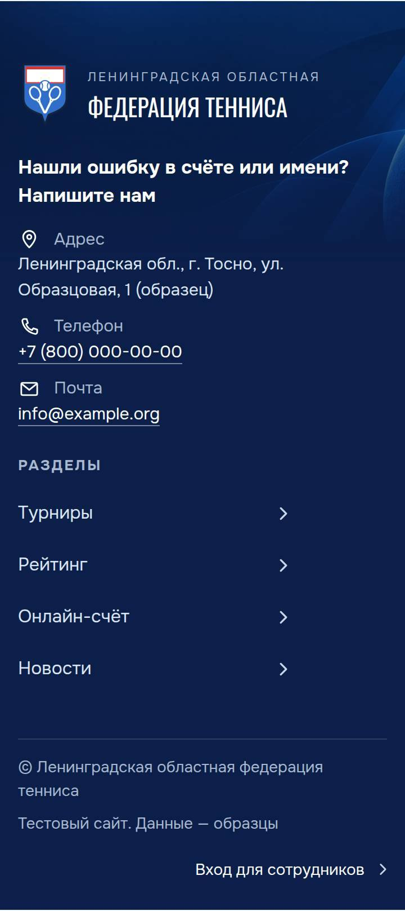

## Первое впечатление

Сайт выглядит как сайт спортивной федерации. Взгляд идёт так: фотография игрока и заголовок турнира, затем рейтинг справа, затем «Сейчас на кортах». Каждую область видно сразу: турнир, рейтинг, матчи сейчас, ближайшие турниры, новости, контакты. Одним словом: спортивно.

## Найдено и исправлено

Все правки — только в стилях, `src/styles/public.css`. Разметка, данные и поведение не менялись.

1. **Планшет: строка разрядов на рубашке игрока.**
   - Где: шапка турнира и главной, ширина от 761 до 1180 пикселей.
   - Что было: длинная строка «Мужчины, одиночный, Юноши до 15 лет, одиночный, Женщины, одиночный» доходила до белой рубашки, где подложка уже прозрачная. Контраст 2,64:1 при 900 пикселях, у «Осеннего кубка» 4,28:1.
   - Что сделано: на этих ширинах сведения о турнире переносятся раньше и кончаются там, где подложка ещё плотная.
   - Стало: не ниже 9:1.
   - Коммит `e23f65b`.

   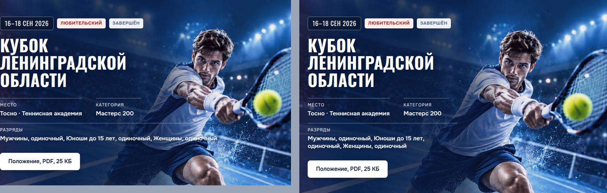

2. **Телефон 320: фамилии рвутся посреди слова.**
   - Где: итоги турнира, таблица очков.
   - Что было: на столбец игроков оставалось 48 пикселей. «Мороз-ов», «Никит-ин», «Георг-ий» рвались на части.
   - Что сделано: на экранах до 400 пикселей текст таблицы 14 пикселей, отступы в ячейках меньше.
   - Стало: каждая фамилия целиком от 320 пикселей. Таблица не прокручивается вбок. Панель любого рейтинга на таком телефоне на 4 пикселя ближе к краю с каждой стороны, строки чуть шире.
   - Коммит `ec42fa5`.

   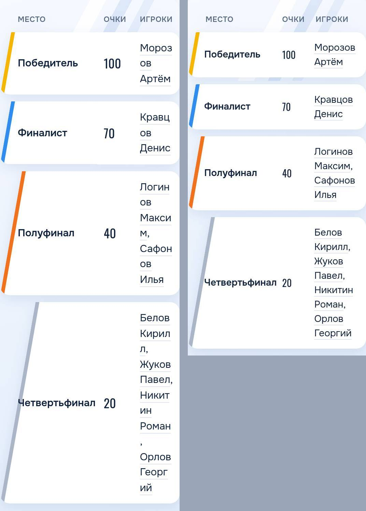

3. **Главная от 1081 до 1440 пикселей: заголовок на лице юноши.**
   - Что было: рядом с рейтингом шапка узкая, игрок сдвигается влево. При 1100 пикселях слово «ОБЛАСТИ» закрывало лицо. Это тот дефект, который заказчик просил убрать.
   - Что сделано: заголовок уменьшается вместе с экраном: 48 пикселей до 1280, 60 пикселей от 1440. Лицо стоит справа от заголовка, как на 1440.
   - Стало: худший контраст текста шапки при 1100 пикселях вырос с 4,13:1 до 8,25:1.
   - Коммит `dbf65f6`.

   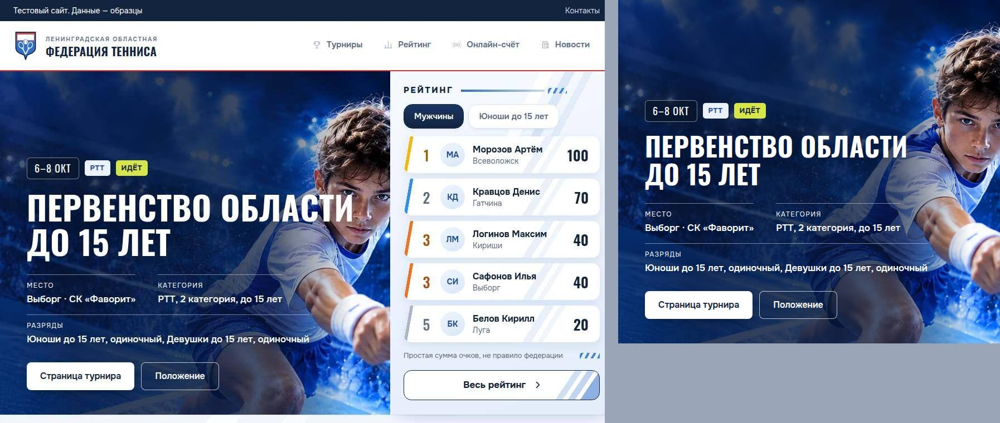

4. **Планшет от 761 до 860 пикселей: заголовок у лица игрока.**
   - Где: главная и шапка турнира.
   - Что было: заголовок 48 пикселей доходил до лица.
   - Что сделано: на планшете заголовок от 40 пикселей при 761 до 48 пикселей от 870.
   - Коммит `c64cb31`.

   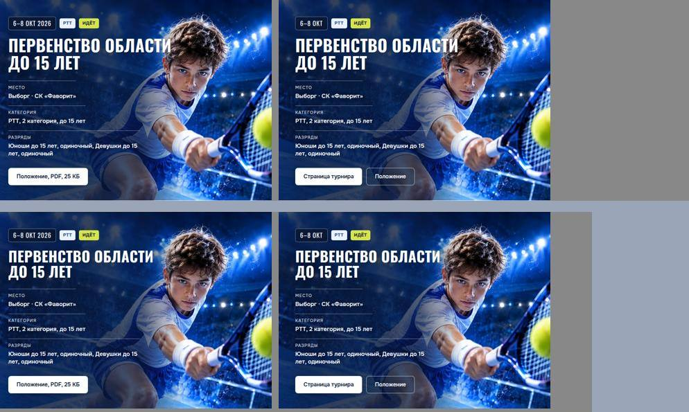

Бриф обновлён: «Фотографии игроков по лигам», «Известные ограничения», «Критерии готовности».

## Проверено без замечаний

- Ни одна страница не прокручивается вбок на 320, 375, 768, 900, 1024, 1100, 1440 и 1920 пикселях. Битых картинок нет, ошибок в консоли нет.
- Цвет места в итогах и цвет цифры места в рейтинге те же, что до правок.
- Полоса группы рейтинга: название читается на всех ширинах, худший контраст 4,68:1 при 320 пикселях, порог для крупного текста 3:1.
- Подвал: худший контраст 7,9:1.
- Экраны судьи и организатора: тот же вид, скругления и тени, синие кнопки. На телефоне не прокручиваются вбок.

  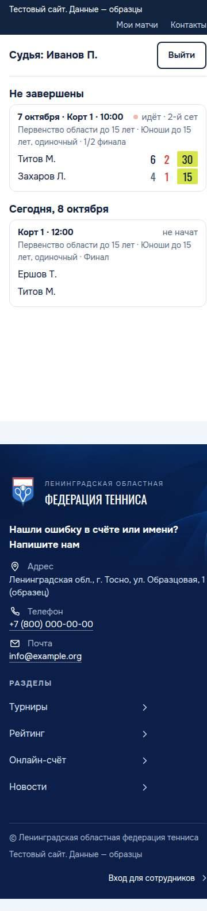

  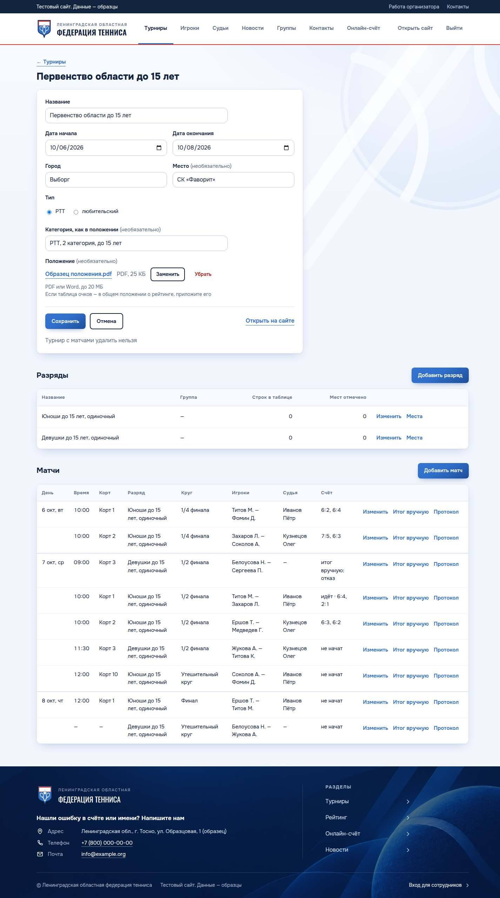

## Отложено

- **Список турниров на широком экране.** В каждой группе по одному турниру, карточка занимает треть ширины, справа пусто. Так раскладываются карточки и до задачи. Исправит больше турниров в данных, а не стиль.
- **Узкая главная от 1081 до 1279 пикселей.** Лицо юноши обрезано у правого края шапки. Шире шапку не сделать, не сдвинув рейтинг. Записано в Брифе.
- **Подписи столбцов таблиц на телефоне 11 пикселей.** Уже отмечено в проверке кода.
- **Дата новости красная, 4,47:1.** Цвет был таким до задачи. Уже отмечено в проверке кода.
- **Кнопки с градиентом и карточки с тенью.** Обычно это признак шаблона. Здесь они взяты из образцов заказчика и одобрены.

## Оценки

- Иерархия: B до правок, A− после.
- Шрифты: A.
- Отступы и сетка: A−.
- Цвет и контраст: B до, A после.
- Состояния элементов: A−.
- Телефон и планшет: B до, A− после.
- Тексты: A−.
- Движение: A.
- Скорость: B+, маска и тень на длинных таблицах не измерены.
- Шаблонность: B.
- Итог: B+ до, A− после.

## Снимки

Все снимки — в `docs/designs/redesign/visual-check/`, после правок:

- главная: `home-1920-top.jpg`, `home-1440.jpg`, `home-900-top.jpg`, `home-375.jpg`, `home-320.jpg`, `home-hero-1300-1380-1440.jpg`;
- турниры: `tournaments-1440.jpg`, `tournament-running-1440.jpg`, `tournament-running-375.jpg`, `tournament-finished-1440.jpg`, `tournament-finished-375.jpg`;
- рейтинг: `rating-1440.jpg`, `rating-375.jpg`, `rating-boys-1440.jpg`, `rating-boys-375.jpg`;
- игрок, онлайн-счёт, новости, протокол: `player-1440.jpg`, `player-375.jpg`, `live-1440.jpg`, `news-1440.jpg`, `protocol-1440.jpg`;
- вход, судья, организатор: `login-375.jpg`, `judge-375.jpg`, `admin-tournament-1440.jpg`, `admin-tournament-375.jpg`;
- телефон крупно: файлы `phone-*.jpg`;
- сверка с образцами: `compare-hero-reference-vs-site.jpg`, `compare-ranking-reference-vs-site.jpg`;
- до и после: файлы `finding-*.jpg`.
