# Тест первой версии: сайт Федерации тенниса ЛО

Проверено в браузере, как это делают посетитель, судья и организатор. Только тестовый сайт задачи и образцы учётных записей.

## Итог

- Все критерии готовности из Брифа выполнены.
- Все истории из Объёма проверены, кроме одной части S9.12: вход судьи держится весь игровой день. Её покрывают автоматические тесты.
- Найдено два дефекта, оба исправлены и проверены повторно.
- Отложено четыре мелочи и четыре пункта из визуальной проверки. Работу сайта они не меняют.
- Оценка здоровья сайта: 95 до исправлений, 98 после.
- Решений руководителя не требуется.

## Как проверяли

- Браузер Chromium без окна, по шагам из сценария. Компьютер — экран 1440 точек, телефон — 390 точек.
- Каждый раз — свежие образцы: база тестового сайта создавалась заново.
- Организатор заводил всё через формы, как человек. Судья работал на телефоне, зритель смотрел онлайн-счёт на другом телефоне.
- Сбои связи изображались так: браузер не пропускал запрос к сайту.
- Ошибки в консоли браузера собирались на каждой странице. За все прогоны их не было.
- Отдельно записан показ работы для человека: 28 коротких роликов на компьютере и на телефоне.

## Критерии готовности

1. Организатор внёс турнир «Кубок проверки»:
   - одиночный разряд и 8 игроков: шесть из общего списка, двое новых;
   - таблица очков и расписание из 7 матчей;
   - новость.

   Всё сразу появилось в календаре, на странице турнира, на главной и в новостях.
2. Судья вёл матч с телефона. Зритель на другом телефоне увидел очко через 9,3 секунды, без перезагрузки. Допустимо до 15 секунд.
3. Организатор внёс итоги вручную, в том числе с пометкой «отказ». Итог виден в онлайн-счёте, на странице турнира и в протоколе с пометкой «внесён вручную».
4. Организатор отметил места восьми игрокам. У всех восьми рейтинг вырос ровно на очки из таблицы.
5. Протокол печатается на одном листе A4. Проверены матч судьи и матч с тремя тай-брейками.
6. 15 публичных страниц на телефоне шириной 390 точек: ни одна не шире экрана. Ширины 320 и 375 проверены на визуальной проверке.
7. Пометка «Тестовый сайт. Данные — образцы» есть на всех проверенных страницах: 15 публичных, 8 страниц организатора и экран судьи.

## Истории

- S1. Календарь делит турниры на идущие, предстоящие и завершённые. Новый турнир сразу попал в «Идут» с городом и отметкой «любительский». Положение скачивается как PDF.
- S2. Онлайн-счёт показывает корт, турнир, разряд, круг, игроков, время и счёт. Без связи дольше 30 секунд появляется «Нет связи с сайтом» с временем обновления; со связью надпись пропадает сама. Пустой день: «Сегодня матчей нет».
- S3. Матчи сгруппированы по дням и кортам. У матча без корта и времени написано «уточняется». Итог вручную заменяет счёт судьи везде.
- S4. Рейтинг:
  - сумма по группе;
  - общее место при равной сумме, следующее пропускается: 7, 7, 9;
  - внутри общего места игроки по алфавиту;
  - игроков без очков в рейтинге нет;
  - пометка «Простая сумма очков, не правило федерации».

  Имя игрока везде ведёт на его страницу. Об игроке сайт отдаёт только имя, фамилию и город.
- S5. Новая новость первой в списке, абзацы сохраняются.
- S6. Сохранение и удаление:
  - При совпадении имени, фамилии и города сайт предупреждает «Такой игрок уже есть».
  - Когда сайт не ответил на сохранение, видно «Не сохранено», введённое остаётся.
  - Удалить нельзя матч с очками, турнир с матчами и игрока с матчами. Пустой турнир удаляется после подтверждения.

  Судьи и правка матча:
  - Новый пароль судьи работает, старый — нет.
  - Матч, переданный другому судье, продолжается с текущего счёта. Прежний судья видит «Матч передан другому судье».
  - Замена игрока в начатом матче счёт не сбрасывает.
  - После пяти неверных паролей вход закрыт на 15 минут. Без входа ничего изменить нельзя.
- S7. Группа требуется только для разряда с таблицей очков. Таблицу очков без положения сохранить нельзя. Переименование строки таблицы места не сбрасывает, новые очки сразу видны в рейтинге.
- S8. Изменённые организатором контакты сразу видны в подвале.
- S9. Судья:
  - Видит только свои матчи сегодня и в следующие дни. Чужой матч и данные организатора ему закрыты.
  - Матч кончается на 6:0, 6:0. Отмена работает и до самого начала, и после конца матча.
  - Когда ответ сайта потерялся, видны красная полоса и «Отправить снова». Кнопки очков заблокированы. Повторная отправка засчитывает очко один раз.
  - Очко со второго телефона по устаревшему счёту не засчитывается, на экране текущий счёт.
  - После итога организатора судья матч больше не ведёт.
- S10. Протокол: турнир, разряд, круг, корт, дата, судья, игроки, победитель, начало и конец, счёт и ход по геймам. Тай-брейки записаны как 7:6(5), тай-брейк считается одним геймом.

Части историй про счёт, отмену и даты дополнительно проверяют автоматические тесты сервера. На этом этапе код сервера не менялся, поэтому они не запускались. Весь набор тестов пройдёт при выпуске.

## Найдено и исправлено

### 1. Ошибочное поле не выделялось красным

Если в строке таблицы очков не было места, сайт писал «Укажите место», но строка оставалась серой. Организатор видел сообщение, но не видел, к какой строке оно относится. То же было с полями счёта при итоге вручную.

Причина: общее оформление полей перекрывало красную рамку. Теперь рамка видна.

Исправлено в коммите 0bc17b3.

До:

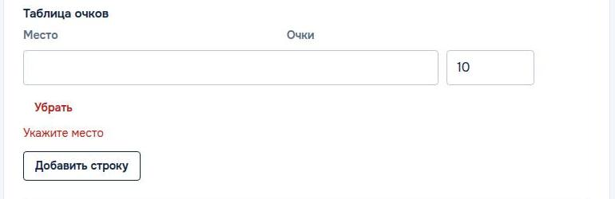

После:

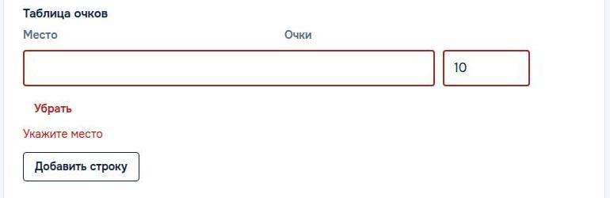

### 2. Итог вручную выделял все шесть полей счёта

При недописанном втором сете красными становились все шесть полей. Красными были и верный первый сет, и пустой третий, хотя третий сет вносить не обязательно.

Теперь выделен только сет с ошибкой. Если счёт противоречит победителю, выделены заполненные сеты, а пустые — никогда.

Исправлено в коммите b377e9f.

До:

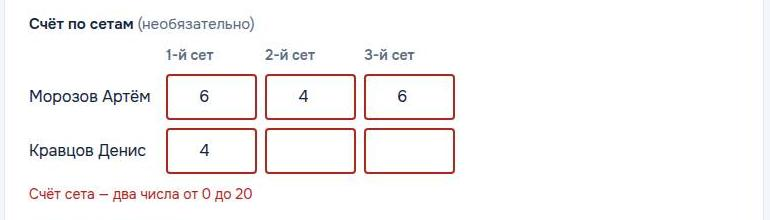

После:

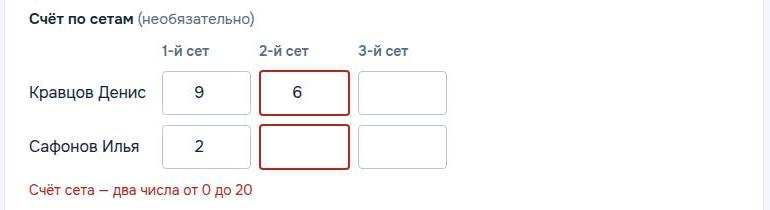

## Отложено

1. Вошедший организатор или судья по ссылке «Вход для сотрудников» снова видит форму входа. Подсказки, что он уже вошёл, нет.
2. В полях счёта при итоге вручную стрелки останавливаются на 7. Сайт принимает до 20, например решающий тай-брейк 10:8, но такое число приходится набирать.
3. Образцы, созданные в первые два часа после полуночи по Москве, показывают странное время. Сегодняшние идущий и законченный матчи начались накануне вечером.

   Образцы этого тестового сайта созданы ночью. Поэтому идущий матч на корте 1 начался в 23:06 предыдущего дня. Касается только образцов.
4. Из визуальной проверки, без изменений:
   - ссылки в верхней полосе и подвале высотой 21 точка;
   - обычная кнопка выбора файла;
   - протокол на широком экране прижат влево;
   - «1/2 финала» на экране 320 точек переносится.

Не дефекты:

- Итог вручную принимает сет 6:6 или 9:2. Так задумано: матч мог прерваться посреди сета или идти в другом формате.
- Сайт не принимает счёт, противоречащий победителю, и незаконченный сет не последним.

## Оценка здоровья

До исправлений 95, после 98 из 100. По разделам после исправлений:

- консоль браузера: 100, ошибок нет;
- ссылки: 100, битых нет;
- внешний вид: 91, три мелочи из визуальной проверки;
- работа функций: 100;
- удобство: 94, отложенные пункты 1 и 2, до исправлений было 78;
- скорость: 100;
- содержание: 97, время в ночных образцах;
- доступность: 97, ссылки высотой 21 точка.

## Снимки

Судья и зритель:

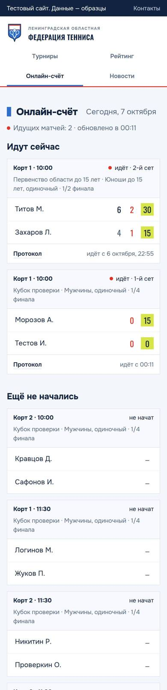

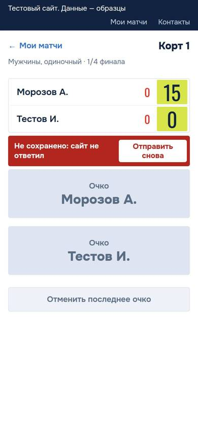

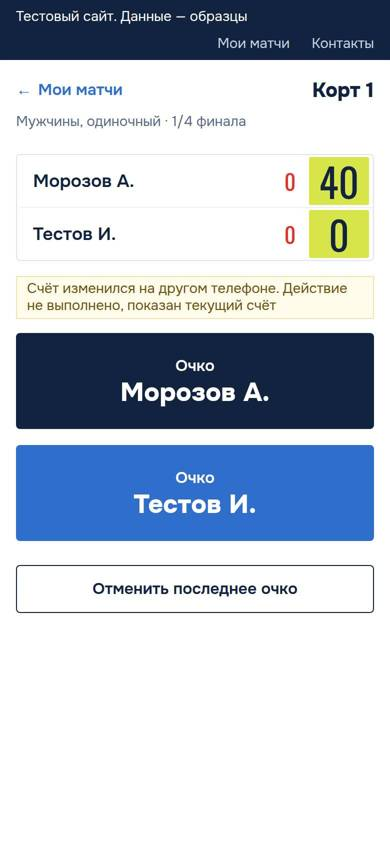

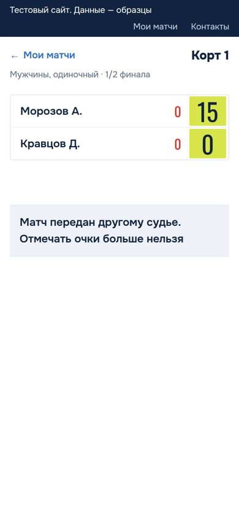

Организатор:

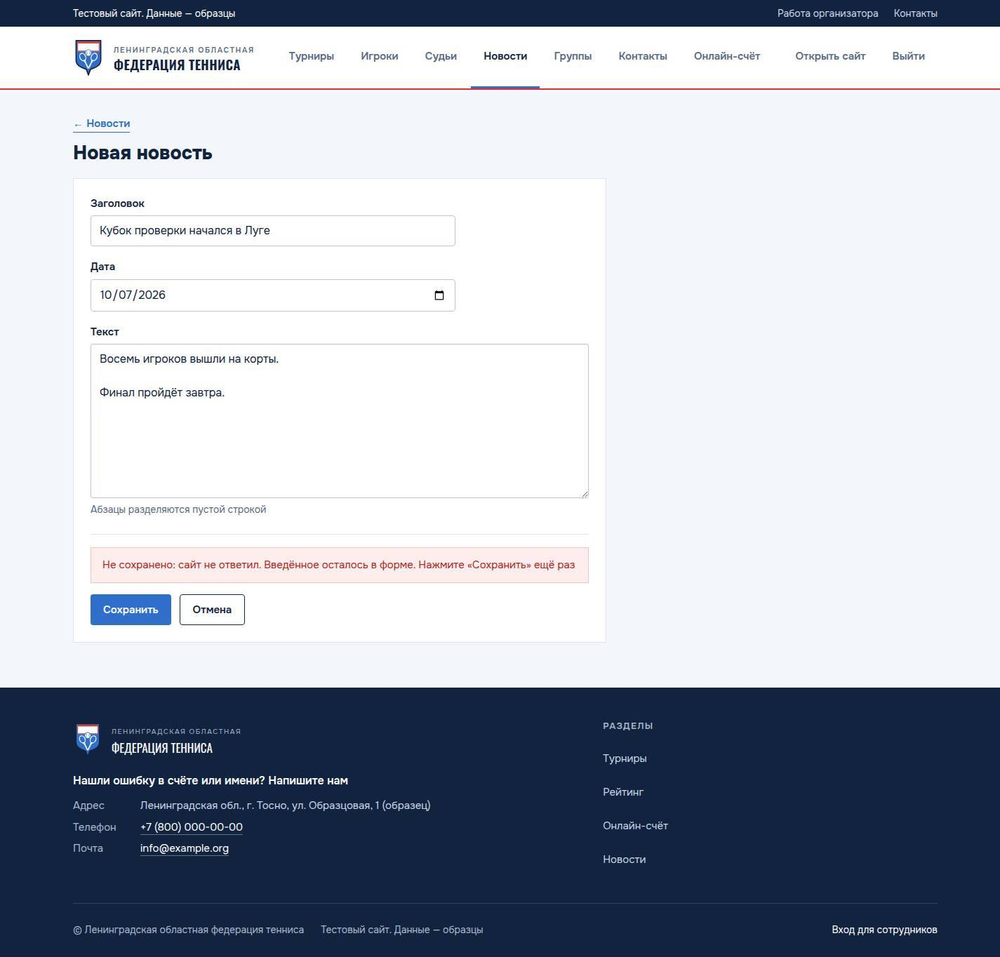

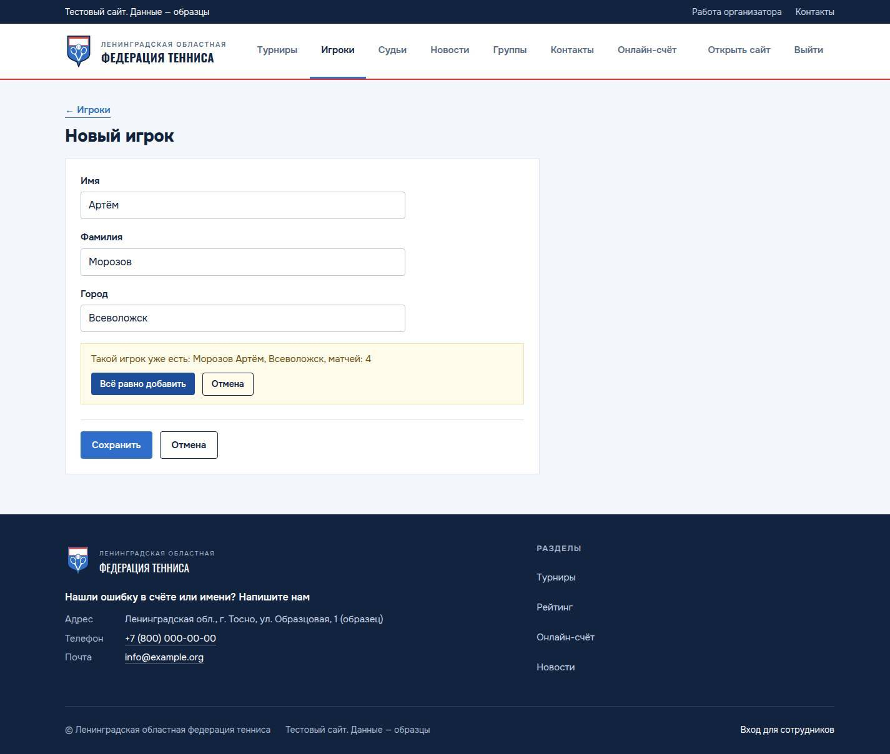

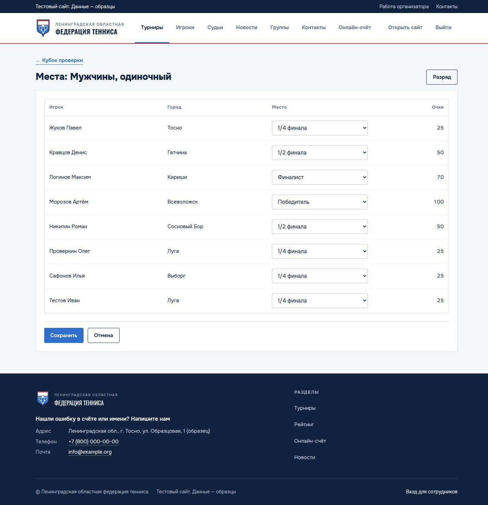

Посетитель:

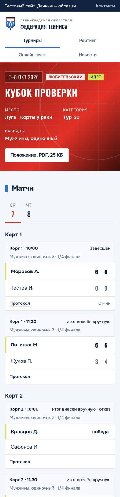

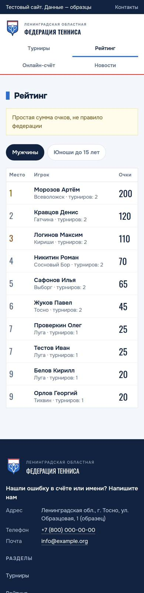

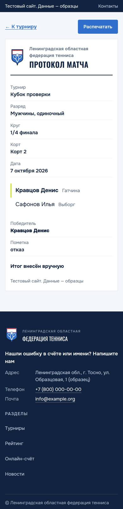

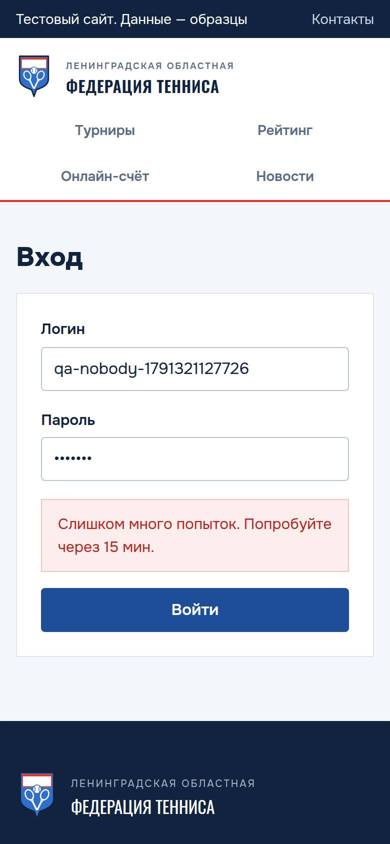

## Проверки и их результат

Скрипты лежат в папке задачи `tmp/pw/` и в репозиторий не входят. `$SITE` — адрес тестового сайта задачи, `$CDP` — адрес её браузера без окна.

- `BASE=$SITE CDP=$CDP node qa.mjs`: приёмка по Брифу и Объёму, 99 проверок, выход 0.
  - Первые два прогона завершились с кодом 1 из-за ошибок в самом скрипте: не те поля ответа и не те ячейки счёта. Дефектами сайта это не было.
  - Перед каждым прогоном база создавалась заново.
- `BASE=$SITE CDP=$CDP TID=4 node qa2.mjs`, 15 проверок, выход 0:
  - незаписанная форма спрашивает перед уходом;
  - «Снять итог»;
  - смена пароля судьи;
  - главная, тай-брейки в протоколе, ссылки на игроков.
- `BASE=$SITE CDP=$CDP TID=4 node qa3.mjs`, выход 0. Неверный ввод организатора:
  - тот же игрок дважды;
  - день вне турнира;
  - конец раньше начала;
  - текстовый файл вместо положения;
  - счёт против победителя;
  - пустой заголовок.

  Всё отклонено с понятным сообщением.
- `BASE=$SITE CDP=$CDP TID=4 node qa4.mjs`, выход 0:
  - турнир нельзя сократить, пока матчи вне новых дат;
  - пустая группа рейтинга и пустой турнир показывают понятный текст;
  - кнопки «назад» и «вперёд» браузера работают.
- `BASE=$SITE CDP=$CDP ID=26 node verify-manual.mjs`: после исправления 2 выделены ровно два поля, выход 0.
- `BASE=$SITE CDP=$CDP NAME=... node verify-rows.mjs`: рамка поля 1 точка серая до исправления 1, 2 точки красная после.
- `node_modules/.bin/tsc --noEmit -p .`: выход 0.
- Повторный прогон после исправлений на свежих образцах: `qa.mjs` — 99 проверок, выход 0; `qa2.mjs` — 15 проверок, выход 0.
- Сценарий показа, пробный прогон `bun dry.ts`: 28 шагов, выход 0 на компьютере и на телефоне. После каждого прогона образцы вернулись в исходный вид.
- Запись показа `/usr/local/lib/heavy-gate/heavy-gate browser bun /srv/projects/vmsetup/board/scripts/record-test.ts --url $SITE`: 56 роликов, выход 0.
  - Первая запись тоже завершилась с кодом 0, но два ролика шли 32 и 95 секунд: мигающая точка «идёт» не давала вырезать ожидание.
  - Во второй записи включено «меньше движения», точка стоит. Эти ролики идут около 6 секунд.
- После всех проверок база тестового сайта создана заново: на сайте только образцы.
