# Визуальная проверка: сайт Федерации тенниса ЛО

Проверен сайт этой задачи на её ветке. Образцы — те же, что выйдут на тестовый сайт. Сравнение — с одобренным прототипом, Брифом и описанием дизайна первой версии. Новый внешний вид не создавался: редизайн — отдельная задача.

## Итог

- Сайт совпадает с прототипом: шапка, меню, цвета, два шрифта, большой блок турнира, карточки, строки матча, таблица рейтинга, подвал.
- Убранное из прототипа по описанию дизайна не вернулось. Каждая страница помечена «Тестовый сайт. Данные — образцы».
- Найдено 11 дефектов, все исправлены. Самый серьёзный: страница турнира у организатора открывалась на телефоне уменьшенной, шириной 691 пиксель вместо 375.
- Ещё 4 мелочи отложены, причины — ниже.
- Критерии Брифа, которые видны глазами, выполнены:
  - ни одна публичная страница и ни один экран судьи не прокручиваются вбок на ширине 320 и 375;
  - протокол каждого проверенного матча печатается на одном листе A4;
  - все страницы помечены как образец.
- Оценка дизайна: до правок B+, после A−. Оценка шаблонности: B до и после — вид задан прототипом.
- Решений руководителя не требуется.

## Как проверяли

- Сайт задачи, запущенный через общий запуск рабочих копий. Свой сервер вручную не запускался.
- Отдельный браузер этой рабочей копии без окна, через Playwright.
- Ширина экрана:
  - компьютер — 1440;
  - телефон — 375 и 320;
  - экран судьи — 375 × 667 и 320 × 568, как требует описание дизайна.
- Печать протокола — лист A4, как печатает браузер.
- Вход — только образцами учётных записей организатора и судьи на сайте этой задачи.
- Всё, что проверка меняла в образцах, возвращено: очки судьи отменены, удаление новости отменено. Ошибка входа проверялась на несуществующем логине.
- Сняты снимки всех публичных страниц, экранов судьи и организатора. Состояния: идущий, завершённый, не начатый матч, итог вручную, страница, которой нет.
- Пройдены сценарии:
  - судья отмечает очко;
  - связь пропадает, судья отправляет очко снова, потом отменяет;
  - онлайн-счёт теряет связь и восстанавливает её;
  - организатор сохраняет пустую форму турнира;
  - организатор открывает и отменяет удаление новости;
  - вход с неверным логином.

## Первое впечатление

Сайт выглядит как сайт спортивной федерации, а не как шаблон. Взгляд идёт так: синий блок идущего турнира, счёт на салатовом фоне, рейтинг справа. Каждую область видно сразу: турнир, рейтинг, матчи сейчас, ближайшие турниры, новости, контакты.

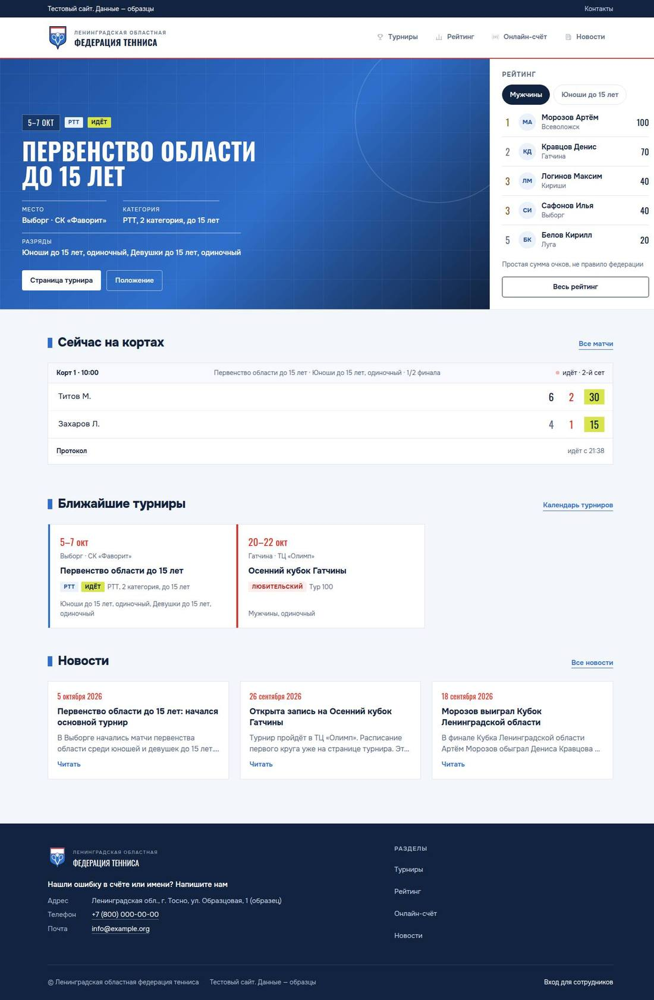

## Найдено и исправлено

1. **Организатор, страница турнира на телефоне — открывалась уменьшенной.**
   - Скрытая подпись столбца «Действия» вылезала из таблицы с прокруткой. Страница становилась шириной 691 пиксель, и телефон уменьшал её почти вдвое.
   - Исправлено стилем таблицы: такие подписи теперь остаются внутри неё. Страница — 375 пикселей, таблицы прокручиваются вбок внутри себя, как в описании дизайна.
   - Коммит 53a15c8.

   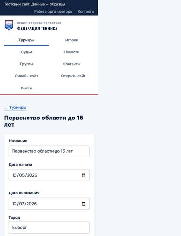
   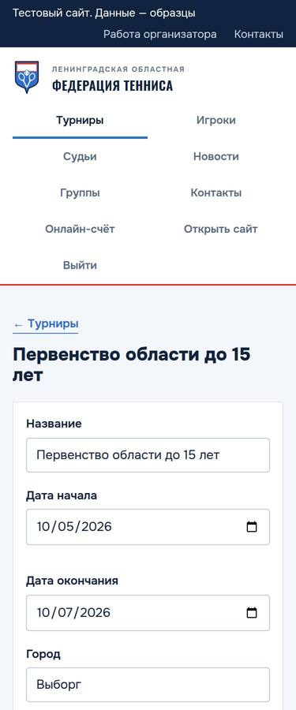

2. **Организатор, таблица матчей — «идёт» дважды: «идёт · 6:4, 2:1 · идёт».**
   - Слово добавляли и сервер, и таблица. Теперь сервер отдаёт только счёт.
   - Добавлен тест, который без исправления не проходит.
   - Коммиты 7e28a51 и b588cb6.

   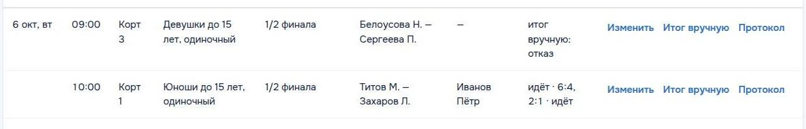
   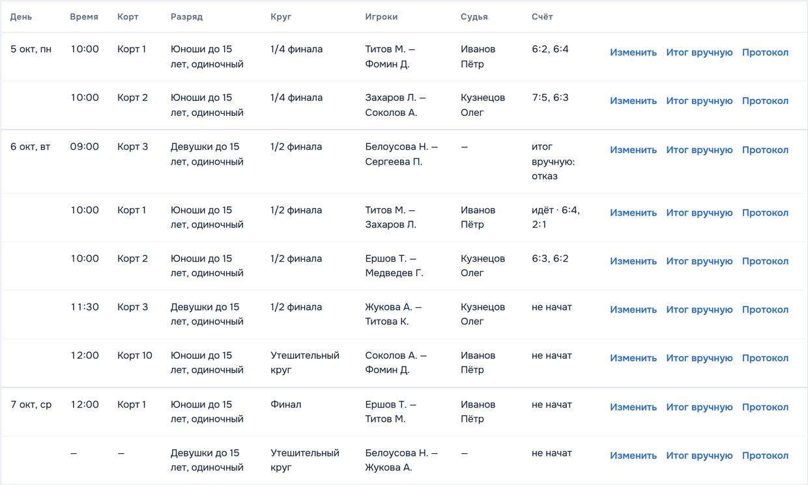

3. **Итоги турнира на телефоне 320 — места рвались посреди слова: «Победите / ль», «Полуфина / л».**
   - Название места теперь переносится только между словами. Длинное название в 34 знака не расширяет страницу.
   - Коммит 6ce39b7.

   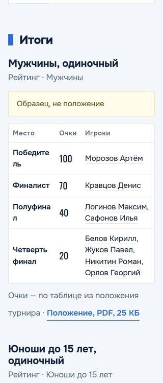
   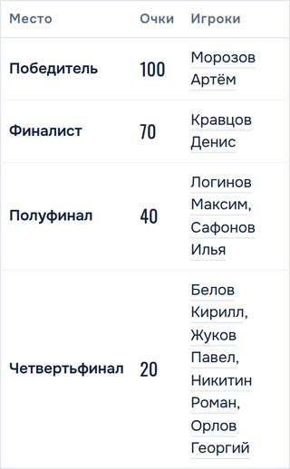

4. **Онлайн-счёт на телефоне 320 — красная точка стояла одна над строкой «Идущих матчей…».**
   - Теперь точка рядом с текстом, а время не отрывается от «обновлено в».
   - Коммит 71b8a53.

   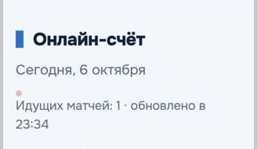
   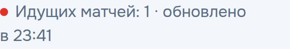

5. **Строка матча на телефоне 320 — низ строки сжимался.** «Счёт — в онлайн-счёте», «Протокол» и время ломались каждое на две строки. Теперь ссылки целые, время переходит на свою строку. Коммит 9562c61.

6. **Ссылка «Протокол» — линия под ней висела на 20 пикселей ниже слова и читалась как лишняя черта.** Теперь подчёркнуто само слово, а нажимается по-прежнему полоса высотой 44 пикселя. Коммит 11539c8.

   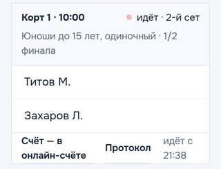
   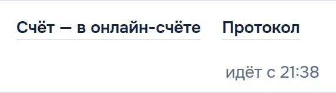
   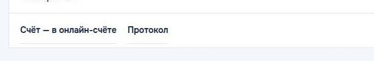
   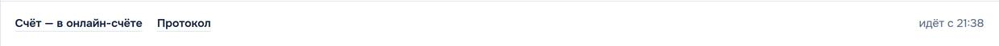

7. **Страница «Такой страницы нет» — без заголовка, мелким текстом.** Теперь это заголовок страницы в стиле разделов сайта. Программа чтения с экрана тоже видит его заголовком. Коммит 7cf366e.

   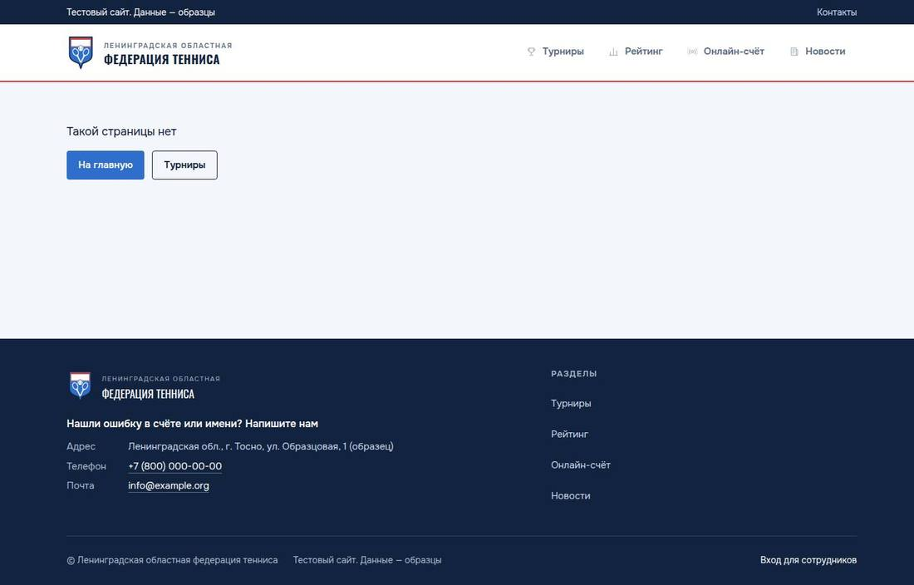
   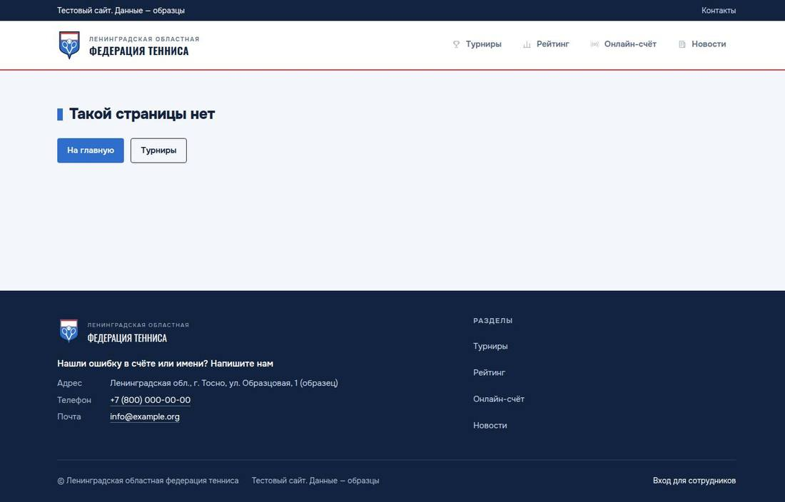

8. **Организатор, таблица матчей — «Корт 1» разрывался на «Корт / 1».** Время и корт теперь в одну строку. Коммит dbe90c2.

9. **Экран судьи — «←Мои матчи» без пробела после стрелки.** Добавлен отступ. Коммит 31486b4.

10. **Печать протокола — страница при печати занимала ровно лист.** Запаса не было: чуть больше поля в браузере — и печатался бы второй пустой лист. Теперь высота — по содержимому. Самый длинный протокол, три сета с тай-брейками, оставляет запас около трети листа. Коммит af10f02.

11. **Вопрос об удалении — ответы разъезжались.**
    - «Да, удалить» стоял на строке вопроса, а его «Отмена» уходила ниже, рядом с «Отменой» формы.
    - Теперь вопрос на своей строке, оба ответа вместе под ним.
    - Коммит e912b2b.

    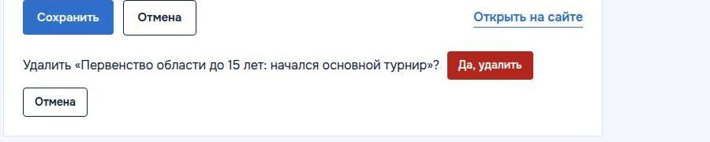
    

## Отложено

1. **Мелкие места нажатия на телефоне.**
   - Ссылки верхней строки «Контакты», «Мои матчи» и телефон с почтой в подвале — высотой 21 пиксель вместо 44.
   - Список из описания дизайна их не называет. Увеличить строку на экране судьи нельзя: на телефоне 320 × 568 вторая кнопка очка ушла бы за край экрана.
   - Имена игроков внутри строк — ссылки в тексте, их обычный размер допустим.
   - Вернуться при редизайне.
2. **Выбор файла положения в новом турнире — стандартная кнопка браузера.** Она не в стиле сайта, но работает. В русском браузере на ней написано «Выберите файл». Для редизайна.
3. **Протокол на широком экране прижат влево, справа пусто.** Лист протокола и так читается и печатается. Для редизайна.
4. **На телефоне 320 «1/2 финала» в строке матча может разорваться на «1/2» и «финала».** Круг вписывает организатор. Это мелочь, правка задела бы код строки матча.

## Не дефекты сайта

- Дата «10/05/2026» и кнопка «Choose File» на снимках — язык самого проверочного браузера, он английский. В браузере на русском будет «05.10.2026» и «Выберите файл».
- В первом проходе протоколы идущего матча и итога вручную напечатались на двух листах. Причина — ошибка проверочного скрипта: он печатал экранный вид. В чистом браузере все протоколы — на одном листе.

## Сверка с прототипом и Брифом

- Цвета и шрифты — из прототипа. На странице только Onest и Oswald. Текст темнее прототипа там, где этого требует описание дизайна. Места 1–3 — тёмные золото, серебро и бронза.
- Рамка фокуса — синяя, 3 пикселя. Первая остановка клавиши Tab — «К содержанию». Мигание точки отключается при уменьшении движения.
- Меню на телефоне — два ряда по два пункта, шапка не прилипает.
- На странице турнира открыт сегодняшний день, у идущего матча вместо цифр — «Счёт — в онлайн-счёте».
- Экран судьи:
  - на 375 × 667 помещается целиком, вместе с «Отменить последнее очко»;
  - на 320 × 568 обе кнопки очка видны без прокрутки;
  - сообщения не сдвигают кнопки;
  - пока очко не сохранено, кнопки серые.
- Онлайн-счёт без связи показывает жёлтую плашку «Нет связи с сайтом…», точка становится серой. Когда связь возвращается, плашка исчезает сама.
- Формы организатора: красная рамка и текст под полем, сообщение «Не сохранено: проверьте поля, отмеченные красным» над кнопками.

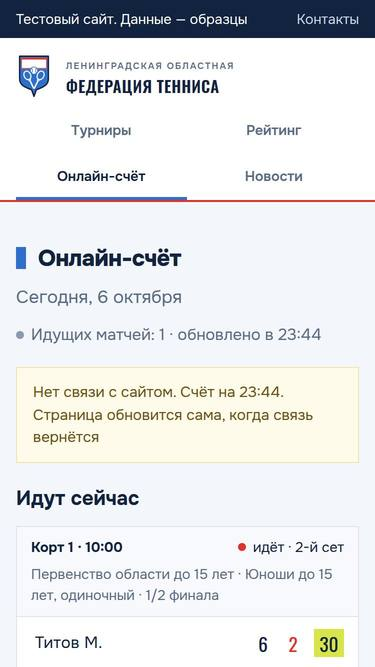
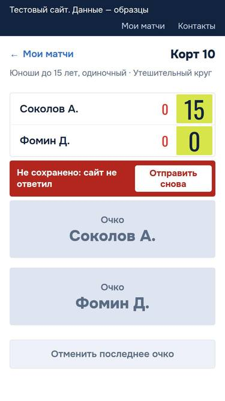
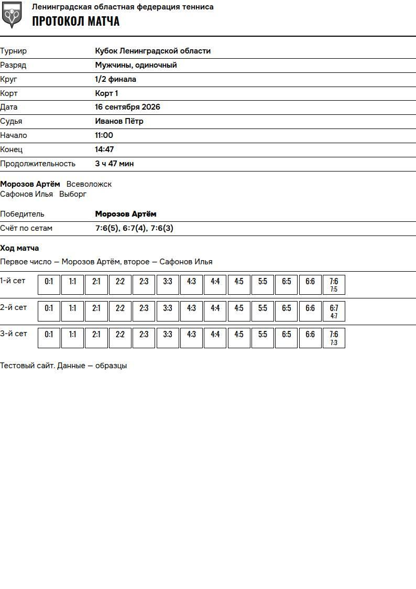

## Оценки

- Иерархия: A после правки страницы «Такой страницы нет».
- Шрифты: A.
- Отступы и сетка: A.
- Цвет и контраст: A.
- Состояния и нажатия: A− из-за отложенных мелких мест нажатия.
- Телефон: A− после правок 1, 3, 4 и 5.
- Тексты: A.
- Движение: A — одна мигающая точка, отключается при уменьшении движения.
- Скорость загрузки не измерялась.
- Итог: до правок B+, после A−. Шаблонность: B — цветная полоса слева у карточек и сетка на фоне большого блока взяты из прототипа.

## Проверки и их результат

SITE — адрес сайта задачи из `paneweb url`, CDP — адрес браузера из `paneweb browser`. Скрипты лежат в рабочей копии в `tmp/pw/`, в коммит не входят.

1. `paneweb up` — сайт уже запущен, код 0. `paneweb browser` — код 0.
2. Снимки до правок: `BASE=$SITE CDP=$CDP OUT=../visual/before node visual.mjs` — 98 снимков и 3 протокола в PDF, ошибок браузера нет, код 0. Найдены дефекты 1 и 10. Двухлистовая печать оказалась ошибкой скрипта.
3. Ширина страницы организатора на телефоне: `BASE=$SITE CDP=$CDP PATH_=/admin/tournaments/2 MOBILE=1 node wideprobe.mjs` — до правки 691 из 375, после 375 из 375, код 0.
4. Печать в чистом браузере: `BASE=$SITE CDP=$CDP IDS=5,14,10,17 node printprobe.mjs` — 4 протокола, по одному листу каждый, код 0.
5. Таблица итогов на 320 и длинное название места: `SHOT=../visual/restable-after.png BASE=$SITE CDP=$CDP node restable.mjs` — ширина 320 из 320, код 0.
6. Тест дефекта 2: `bun run test server/admin-score-text.test.ts` — без исправления код 1, получено «1:0 · идёт». С исправлением 1 тест прошёл, код 0.
7. Тесты, которые доходят до изменённого вида организатора: `bun run test server/admin-score-text.test.ts server/admin.test.ts server/files.test.ts` — 24 теста прошли, код 0.
8. Типы: `node_modules/.bin/tsc --noEmit -p .` — код 0.
9. Сценарии: `BASE=$SITE CDP=$CDP OUT=../visual/flows node flows.mjs` — 14 проверок прошли, ошибок браузера нет, код 0. Первый запуск дал код 1 из-за ошибки самой проверки: она читала поле не из того ответа сайта. Матч при этом вернулся в «не начат».
10. Снимки после правок: `BASE=$SITE CDP=$CDP node visual.mjs`, затем папка снимков перенесена в `tmp/visual/after` — 98 снимков. Ни одна страница не шире экрана, 3 протокола по одному листу, ошибок браузера нет, код 0.
11. Шрифты, цвета, заголовки, фокус: `BASE=$SITE CDP=$CDP node system.mjs` — код 0.

Полный набор тестов не запускался: он идёт на выпуске.
